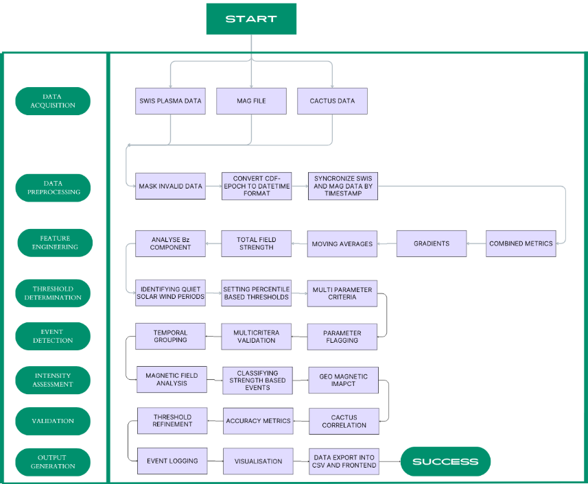

The project aims to develop an automated method for detecting Halo Coronal Mass Ejection (CME) events using in-situ solar wind data from the Aditya-L1 mission at the L1 Lagrange point. By leveraging Level-2 BLK files from the SWIS-ASPEX payload, which provide high-resolution plasma parameters such as proton density, speed, and temperature, the approach involves analyzing these time series, engineering features like moving averages, gradients, and combined metrics (e.g., density × speed), and applying statistical, data-driven thresholds to flag potential CME events. Magnetic field measurements (Bx, By, Bz) from the MAG payload are integrated to confirm CME signatures and assess event intensity. Detected events are validated against the CACTUS CME catalog to ensure accuracy. This solution enables real-time, in-situ CME detection at L1, improves space weather forecasting and early warning for critical infrastructure, and demonstrates a novel, multi-parameter approach using Indian mission data.

thank you!
